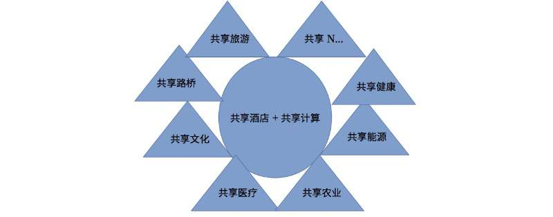
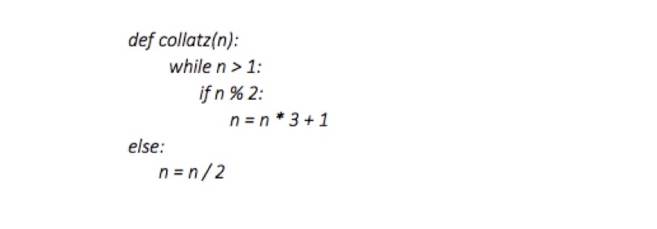

# 
**瓦贝共享公有区块链平台白皮书**

## 
实体数字化样本

### 
v1.0

#### 

### 
**Github**:[Https://github.com/wabei](Https://github.com/wabei)

### 
2018年5月

<!-- TOC -->

## 目录
- [前言](#前言)
- [一、项目摘要](#1-项目摘要)
- [二、项目介绍（设计原理及理念）](#2-项目介绍（设计原理及理念）)
    - [2.1 行业背景](#21-行业背景)
    - [2.2 瓦贝链的设计理念](#22-瓦贝链的设计理念)
    - [2.3 瓦贝链的设计原则](#23-瓦贝链的设计原则)
    - [2.4 产品模型与架构](#24-瓦贝链的设计原则)
    - [2.5 技术创新](#25-瓦贝链的设计原则)
    - [2.6 安全策略](#26-瓦贝链的设计原则)
    - [2.7 国密算法改造](#26-国密算法改造)
- [三、瓦贝链的应用实施方案](#3-瓦贝链的应用实施方案)
    - [3.1挖矿共识算法ethash](#31-挖矿共识算法ethash)
    - [3.2 项目应用落地](#32-项目应用落地)
    - [3.3 资源对接](#33-资源对接)
    - [3.4 生态激励机制(#34-生态激励机制)
- [四、项目前景展望](#4-项目前景展望)
    - [4.1 钱包合约](#41-钱包合约)
    - [4.2 社区组织](#42-社区组织)
    - [4.3 社交网络](#43-社交网络)
- [五、核心团队成员介绍](#5-核心团队成员介绍)
- [六、瓦贝链的安全管控及审计事项](#6-瓦贝链的安全管控及审计事项)
    - [6.1 交易安全](#41-交易安全)
    - [6.2 专业审计](#42-专业审计)
- [七、风险提示及免责声明](#4-风险提示及免责声明)
- [八、总结](#4-总结)
- [参考文献](#参考文献)
- [关于我们](#关于我们)

<!-- /TOC -->

## 前言 
   在资本和霸权笼罩的地球上，人类为了物质利益的争夺，从古至今，用强权和垄断资本去控制资源、获得人民劳动剩余价值似乎成为永恒不变的主题，我们要用技术的力量打破这种不公平，回到人类发展的俩个基点，实现反向平衡，即使民众可以用消费去控制引导生产，让民众消费获长期回报，由此产生消费为项目融资，项目为消费提供产品及投资回报的商业模式，同时实现大量闲置资产的二次优化利用，而这一共享经济模式要依赖于与去中心化技术的实现——区块链技术。愿我们的努力能让世界更加平和、人民生活更加幸福！由此诞生——瓦贝共享公有区块链。

## 一、项目摘要

   瓦贝链是共享经济区块链化的表现形式，平台整合社会闲置资产资源产品，合理优化后为社会共享使用，达到物品尽其用，最大回馈社会的目的。瓦贝链的突出贡献在于使社会闲置资源得到经济利用和再利用，解决社会资源闲置利用和流动性问题，瓦贝链是以区块链技术为核心技术支撑，从技术角度看，将实体闲置资产资源产品甚至是服务产品数字化，促进其价值流动和二次利用，最有效措施是使用区块链技术，因此，区块链技术也被称为价值互联网技术，而瓦贝链是价值互联网在共享经济领域的实现形式之一。

## 二、项目介绍（设计原则与理念)
### 2.1 行业背景 
   共享经济，即瓦贝链的经济学原理，这个术语最早由美国德克萨斯州立大学社会学教授马科斯·费尔逊（Marcus Felson）和伊利诺伊大学社会学教授琼·斯潘思（Joel.Spaeth）于1978年发表的论文（Community Structureand Collaborative Consumption:ARoutine Activity Approach）中提出。其主要特点是，包括一个由第三方创建的、以信息技术为基础的市场平台。这个第三方可以是商业机构、组织或者政府。个体借助这些平台，交换闲置物品，分享自己的知识、经验，或者向企业、某个创新项目筹集资金。经济牵扯到三大主体，即商品或服务的需求方、供给方和共享经济平台。共享经济平台作为连接供需双方的纽带，通过移动LBS应用、动态算法与定价、双方互评体系等一系列机制的建立，使得供给与需求方通过共享经济平台进行交易。近五年来，中国共享经济呈现跨越式发展态势，其更新换代和创造新就业的速度引得全球瞩目，滴滴、ofo、运满满等代表企业的业务和运营模式领先全球。依靠发达的线上移动支付技术和线下物流设施，搭乘政府双创政策和中国风投的快车，共享经济的“中国模式”正在成型。一些共享经济从业者和创投界人士认为，属于中国的共享经济时代正在到来。
   共享经济正深度重塑中国的经济形态。从工农业生产到老百姓衣食住行，以物联网为基础的共享经济正给产能过剩、产品过剩、发展不平衡不充分的中国带来新的发展机会。共享经济中国模式渐成型 未来将保持40%高增长。同时我们也看到中国共享经济，正在走向服务全球化。
### 2.2 瓦贝链的设计理念 
   瓦贝链以共享房屋为核心，将闲置资产数字化，解决资产流动性问题和二次利用，使其发挥社会价值；之所以使用区块链技术来解决闲置资产流动问题，主要原因在于目前从全球范围来看，最能够引起市场关心和投资的资产是以区块链技术为核心的数字化资产，同时我们也看到共享经济离不开互联网，而共享经济搭乘价值互联网——区块链后将如虎添翼，由此诞生瓦贝链。
   瓦贝链的核心价值有三点：1）实业项目产品数字化，借区块链新成数字资产实现流动性；2）实业实现预售融资，0负担解决企业发展融资问题；3）消费回报。具体成操作见下述第三章第2项。
   瓦贝链在常规共享经济的基础上，引入回报共享，拿mobike单车案例（当然我们不会介入这个已经饱和的行业）为例：目前的情况是大家用小额消费的方式为mobike公司支付了一辆自行车的使用成本，后续大家消费使用这辆自行车的支出，将成为mobike公司的利润，或许mobike公司为了提高竞争力而降低使用费甚至阶段性免费，但mobike公司永远不会将到手的利润回馈给消费者，他只承认法律上的投资者，并给予回报，而不会承认那些不特定的消费群体其实才是mobike公司真正的投资者。基于现有的法律框架和商业逻辑，mobike公司无可厚非，形成了众星捧月般的商业帝国，其慈善行为饱受夸奖，尽管其利润来自平民的消费投资；瓦贝链打破这种格局，让消费者以区块链数字资产购买的方式购买“mobike”的使用权，就像他们花1元钱骑车一样，区块链中出售的“mobike”使用权也是1元/次并获得对应的数字资产token权限——瓦贝token,至此，瓦贝链消费者获得看似和mobike公司一样的权益，但实则不一样，瓦贝链赋予了消费者数字资产的增值和流动性是摩拜公司等共享经济模式不能提供的；与此同时，瓦贝链引入消费回报模式，即要求被消费投资的这些“摩拜公司”将大部分经营利润返还给消费投资者，当然由于token的高流动特点，我们的返回模式也是颇具创新，详见下述“共享房屋”为核心的回馈模式。

### 2.3 瓦贝链的设计原则 

   瓦贝链的核心设计原则在于将实体产品、服务产品数字化出售，购买者购得该数字产品后可进行二次转让交易、凭证消费、捐赠等。商家在链上预售出自己的产品后，所得资金用于发展自己的项目，向巨著公司（购买人代表，瓦贝链的主要发起人之一）开具统一增值税发票，其通过瓦贝链售出的产品统一由巨著公司统一代为管理，产品可分期交付，巨著公司也可以要求商家回购，由于商业项目资金来自购买者的消费投资因此有能力的商家将继续负责其预售产品所属项目的后期管理和收取不超过50%的管理费部分收益，其余50%的收益都打入瓦贝链的内部的银行托管专用公益账户，收益分配动作于预售产品交付或回购完成后确有利润产生时进行。瓦贝链公益账户由银行托管、瓦贝链发起机构、公证机构、律师事务所、审计机构共同管理，经审计的公益金账簿在各家网站公示；公益金专项用于补助币持有人在瓦贝链系统内的消费支出。瓦贝链商家的股份由瓦贝链发起人做风险控制，确保项目方履约。
### 2.4 产品模型与架构
                                     
### 2.5 技术创新
   双池价值计划
   
   瓦贝池指的是预制到瓦贝链的2000万个瓦贝数字资产和矿工挖矿所得的瓦贝数字资产总和，矿工每年挖矿总额不超过500万个，后期经矿工大会讨论可减半生产或逐渐停产。
   实物池，指4项中，各模块具体项目通过数字资产方式发行预售的实物或服务产品以及后期项目回馈给公益账户的预售产品、服务、法币现金及现金等价物。
   瓦贝链的技术创新核心在于商业模式设计创新。瓦贝池代表实物池进行交易和流通，实物池的生产力不断补充和提升链码池的价值，因此未来瓦贝链的核心数字资产瓦贝价值将不断提升，而区别于空气币类的数字资产。
### 2.6 安全策略
   瓦贝链基于以太坊网络开发，是瓦贝网络是以太坊网络的的兄弟成员之一，与全世界上万个程序员组织一样，瓦贝链开发组认可以太坊网络的安全策略和开源精神，并持续为以太坊网络改进而努力，瓦贝链的安全策略因此可参照瓦贝网络的安全策路，但与ethereum不同的是，我们封闭了test和Rinkeby测试网络，确保瓦贝链的开发基于瓦贝网络生态网络并能够汲取其营养，同时智能合约功能也不对视频、图片传输类合约开放，使瓦贝链高效验证和安全运行，不拥堵，最大限度减少被攻击的可能，同时在ethash算法的基础上增加神经网络。瓦贝网络作为一个在大范围内复制、共享账本的图灵完备状态机,能让世界上任何能购买 0.3 美分价值（VB写这篇文章时的价格，现在以太价格接近700美元！要运行代码越来越贵，这是需要解决的问题）以太币的人上传代码，然后网络中的每一个参与者都必须在自己本地的机器上运行这段代码，这确实是会带来一些明显的与安全性相关的忧虑。毕竟,其他的一些平台也提供类似的功能，这包括了 Flash 和Java，它们经常碰到“堆与缓冲区溢出攻击”,沙盒逃逸攻击以及大量的其他漏洞，让攻击者可以做任何事情,甚至包括控制你的整台计算机。除此之外,还会有拒绝服务攻击(DDOS)，强迫虚拟机去执行无限循环的代码。
   安全性设计:为解决这些挑战,瓦贝链项目引入了不少的策略。首先引入瓦贝网络的EVM虚拟机,瓦贝网络的虚拟机的架构是高度简化和受限的,之所以要从头搭建一个全新的虚拟机而不是用如 Java 这样现有的虚拟机，是为了实现虚拟机的高度安全性。与访问系统资源、直接读取内存、与文件系统互动的操作代码(Op Codes)在 EVM 瓦贝网络虚拟机的设计中是不存在的。与此相反，唯一存在的“系统”或“环境”操作代码是 与瓦贝网络“状态”里定义的架构进行互动的，虚拟机内存、堆栈、存储空间、代码以及区块链环境信息(如时间戳)。瓦贝网络虚拟机的大多数实施方案是解释型的,不过有一个由 JIT 编译的虚拟机已经被开发出来了。瓦贝网络虚拟机(以及瓦贝网络协议的其他部分)已经有 6 个实施版本了,也经历了超过50000个单元测试,以确保完美的兼容性和确定性的执行结果。 Go语言、C++和Python语言的实施版本在我们的安全审计机构 Deja Vu 的帮助下,已经进行了深度的安全性审计。在瓦贝网络发布后的几个月时间里，发现过几个需要修复的安全性漏洞,不过这种事发生的频率已经大幅度降 低了:在本文行文前的两个月,瓦贝网络网络一直在正常运行,而没有发现任何明显的安全性漏洞。其次，无限循环攻击的解决方案是最复杂的。总体上说,任何图灵完备的编程语言 在理论上都是会碰到“停机问题”的,即不可能预先确定给定程序在给定的输入 值下进行运行是否会出现停机问题。其中一个例子就是考拉兹猜想(Collatz Conjecture)。假设有如下的程序:
    
   该猜想认为,如果你使用任何输入值去运行这个程序,这个程序最终会停止, 不过我们并不能证明这一点;若在找到一个反面例子的情况下我们就可以证明“并不是这样的”,但现在人们已经尝试过 1 万亿以上的输入值了,也没能找到 这样的一个反面例子。因此,这带来了一个忧虑——攻击者可以创建一个合约, 里面包含一些混淆的无限循环代码,然后往这个合约里面发送一笔交易,从而将 系统拖垮。
   瓦贝网络解决这个问题的概念是汽油(Gas):交易的发送者定义他们授权代 码运行所需的最大计算步数,然后为此支付相应比例的以太币。在实际中，不同 的操作过程需要耗费不同的 Gas 数量,这些耗费的标准不仅是基于执行每一种操作过程所需的运算时间,还包括如全节点储存以及内存耗费等考量因素，所以 Gas 并不只是一个用于统计运算步数的标准,不过我们初步就理解成“Gas=计算步数”吧，这对理解 Gas 的用途基本上足够了。
   若在执行交易的过程中“Gas”被耗尽了,如超出了其允许的最大计算步数所需的预算,则交易的执行会被回滚,但交易还是正确的(只是不再有效了),发送者照样要付相应的费用;因此,交易的发送者必须在下面两种策略之间进行取舍:设置一个更高的 Gas 限额,这可能会支付更高的交易费;或设置一个较低的 Gas 限额,这样可能会创建出一个会被回滚的交易,就需要以一个更高的限额重新发送一遍了。信息(译者注:可用于合约间互动的一个特性)本身也可以设置 Gas 的限额,因此可能让一个合约与其他合约进行互动,而无需担心其他合约会无节制地消耗自己的合约里的 Gas“预算”。这个机制已经被密码学学者 Andrew Miller 及其他人审查过了,其结论是这个机制确实能实现逃过停机问题的目的,并以经济学的方式分配运算能力，不过在某些边缘案例中激励机制可能不是一个最优解 。
   第三个安全性问题在较高的层面展现出来，例如我看到某人提供的一个智能合约，上面写着它是一个二元期权合约，需要收取 10 美元的费用，而且若 3 月 30 日的金价超过 1100 美元时则会向你支付 20 美元，我如何知道这是真的呢?如果这是一个合约,用于管理整个市场内的二元期权合约，让用户可以出价、投标、 完成交易，我如何知道这个合约没有能让作者拿着所有的钱跑路的后门呢?一个更好的问题是，假设这个合约的作者编程水平有限,他们如何知道自己写出的程序代码没有漏洞，让大家永远都没法将钱从合约中拿走呢?上述的两个问题分别是程序员作恶和程序员出错，是独立的问题，而解决问题也有所不同,但两者之间还是有共同点的。在瓦贝网络里面对这两种挑战的解决方案分别是一般性的和高等级的解决方案。高等级解决方案在理论上能提供更好的希望，不过会带来整合的难度,以及更依赖于复杂的工具。
而针对作恶问题的一般性解决方案有两个层面。第一,在瓦贝网络里,我们明确以下两者的区别, 即应用程序的核心(纯粹由智能合约的集合构成)以及界面(HTML 和 Java 代码通过读取区块链及发送交易的方式与核心通讯)。
   
   Dapp界面，这是一个为担保交易 Dapp 应用而设的简单、美观的用户界面。不过你怎么 知道点击“移除”按钮时并不是将你的全部钱发送给开发者呢?
   我们的目标是让核心变得可信,若要实现这点,核心就必须尽量精简，并且经过深入的审计和审查，而用户界面可能包括大量的代码，可以无需这么信任。我们的一个中期的设计目标是让瓦贝网络用户界面去保护用户，以免他们受到来自作恶的交易界面的损害，比如通过强制性的弹出一个“你是否想将带有这些数据的 一个交易发送到这个合约里?”对话框(或其他形式的通知方法)。我们希望会呈现出一些专业事务所的市场空间，就如今天律师事务所创建标准化法律合约那样，这些专业事务所会为不同的用例创建标准化的合约，并让这些合约接受来自第三方审计人员的深入检查。
审计和标准化可以减少代码错误带来的损害,不过在错误的特例里,已经有 人进行了数十年的研究,引入了一种强类型要求的编程语言,专门用于避免错误; 这类语言让你可以更丰富地指定每一种数据的含义,并自动防止数据被以明显错 误的方式组合起来(如时间戳加上了一个货币价值,或由区块哈希值分割的地址)。
更高级的解决方案集合依赖于名为形式化验证(Formal Verification)的技术。简单地说，形式化验证就是使用计算机程序自动地在数学的层面上证明关于其他计算机程序的语句。其中一个简单的例子就是证明一个排序算法的正确性: 给定一段代码,它以一个数组作为输入项,并提供一个数组作为输出项,你可以插入一个“定理”,如for x ε I: x ε O; j > i => O[j] >= Oi。形式化验证者将会处理这个代码，构造出肯定或否定这个定理的数学证明,或放弃处理(在考拉兹猜想的例子里有可能会这样)。Aesthetic Integration 公司的 Imandra 产品甚至可以自动找出错误定理的反面例子。目前，瓦贝网络的高级编程语言 Solidity(编译到瓦贝网络的字节码)的主导开发者 Christian Reitwiessner 正在将形式化证明引擎 Why3 整合到 Solidity 里面,让用户可以在 Solidity 程序里面插入与某种数学论点有关的证据,并在 编译的时候进行验证;还有一个项目在将 lmandra 整合到瓦贝网络虚拟机的代码里。
   
   通过 why3 引擎实现 Solidity 的形式化证明
形式化证明是一项强大的技术;不过它无法解决这样的一个问题:有一些事情，可能连我们自己都不知道应该要去证明。人类对公平和正确性的定义往往是非常复杂的，而由此带来的复杂影响往往是难以检测的。市场的订单本(Order Book,即撮合交易引擎常见的买卖单系统)通常需要有一些基础的正确性规则(你要不就以所出的价格得到你需要的东西,要不系统就把钱返还给你)，顺序的不变性(为了防止 front-running,即所谓的提前交易或抢单)，确保每一个买家和卖家都能与最佳的对手单匹配上，以及其他等等。不幸的是，我们并不能简单地将所有的情况都列举出来,也无法确保我们没有任何遗漏的事项。现在看来，对我们来说选择什么东西进行验证会是继续是一项艺术般难题，不过形式化证明技术肯定会降低攻击者们进行攻击的自由度，让对代码进行审计的人员降低负担。
   在一个私有链的实例里面,并不一定要用以太币去支付 Gas(或者其他密码学代币);你可以直接给用户分配“Gas 资源“,有点像亚马逊云服务器给客服分配“CPU时间”一样,你也可以简单地要求所有的交易都包含一个给定的最大限制(如每个交易的 gas 上限是 100 万),(这样即使有人发动无限循环攻击,他也只能最多执行 100 万 Gas 允许执行的计算步数,无法导致系统长期的死循环)。不过，除了虚拟机的安全性外我们还有其他需要考虑的事情：在瓦贝网络平台上，用户若要与一个智能合约进行互动，必须确定他们面对的程序是以他们想象中的执行方式去运行，例如,一个旨在进行遗产分配的智能合约，用户必须确定当自己的财产划拨进这个智能合约后，这个智能合约在日后真的会自动地按照设定的规则去分配遗产。区块链是一个提供了密码学担保的平台，具有一定的便利性,毕竟代码是存储在区块链上的，所有与合约相关的参与者都能查看此代码，用户也能确定代码真的会被执行，不过若要确保不存在任何形式的作恶行为和意外的漏洞,这依然具有挑战性(可参考 Underhanded Contest,这是 一个所谓的“卑鄙 C 程序大赛”,专门编写一些“说是一套,做是另一套”的程序,里面的一些例子具有相当的代表性)。我们推荐用户去探索形式化验证技术, 在他们与代码互动的过程中进行自动化的验证，在金融行业的用例里面，涉及的经济利益较大，这样的技术可能是很有用的。
    
## 三、 瓦贝链的应用实施方案
### 3.1 挖矿共识算法ethash 
   挖矿这个词源于对加密货币与黄金的类比。黄金或贵金属很稀有，电子代币也是，增加总量的唯一方法就是挖矿。瓦贝网络网络也是这样，发行的唯一办法就是挖矿。但是不像其他例子，挖矿也是通过在区块链中创建、验证、发行和传播区块来保护网络的方法。瓦贝链是瓦贝网络网络的成员之一，与全世界上万个程序工作组一样，共同维护着瓦贝网络网络，而维护网络的通行办法是：挖瓦贝=保护网络=验证计算=记账。
   3.1.1什么是挖矿
   以太坊网络中包含瓦贝网络主网、私有链、联盟链、政府公共链以及像瓦贝链这样的联盟以太链，瓦贝链和所有区块链技术一样，使用激励驱动的安全模式。共识基于选择具有最高总难度的区块。矿工创造区块，其他人检测有效性。区块只有在包含特定难度的工作量时才有效，还有其他合格性条件。请注意到瓦贝网络Serenity里程碑，可能就会被取代（参考权益证明模型）。
   瓦贝网络区块链在很多方面与比特币区块链类似，但也有些不同。在区块链架构方面，瓦贝网络和比特币之间最主要的的区别是，不像比特币，瓦贝网络区块不仅包含交易列表也包含最近状态（merkle patricia特里结构的根散表编码在状态中更精确）除此之外，另外两个值，区块数和难度，也储存在区块中。
   使用的工作量证明算法叫Ethash（Dagger-Hashimoto算法的改良版本），包括找到算法的随机数输入以使结果低于特定的难度阈值。工作量证明算法的意义在于，要找到这样一个随机数，没有比列举可能性更好的策略，而解决方法的验证琐碎又廉价。由于输出有均匀分布（是散表功能应用的结果），我们可以保证，平均而言，需要找到这样一个随机数的时间取决于难度阈值。这使得只通过操纵难度来控制找到新区块的时间成为可能。
正如协议中所描述的，难度动态调整的方式是每15秒整个网络会产生一个区块。我们说网络用15秒区块时间生产一个区块链。这个“心跳”基本上主要强调系统状态同步，保证不可能维持一个分叉（允许double spend）或被恶意分子重写历史，除非攻击者有半数以上的网络挖矿能力（即所谓的51%攻击）。
任何参与到网络的节点都可能是矿工，预期的挖矿收益和他们的（相对）挖矿能力或者说成正比，比如被网络总散表率标准化的，每秒尝试的随机数数量。
Ethash工作量证明是内存难解的，这使它能抵抗ASIC。内存难解性由工作量证明算法实现，需要选择依靠随机数和区块标题的固定资源的子集合。这个资源（几十亿字节大小的数据）叫做DAG。每3000个区块的DAG完全不同，125小时的窗口叫做epoch（大约5.2天），需要一点时间来生成。由于DAG只由区块高度决定，它可以被事先生成，如果没有被事先生成，客户端需要等到进程最后来生产区块。如果客户端没有预生成并提前缓存DAG，网络可能会在每个epoch过渡经历大规模区块延迟。注意不必要生成DAG以验证工作量证明，它可以在低CPU和小内存的状态下被验证。
在特殊情况下，从零开始创建节点的时候，只有在为现存epoch创建DAG的时候才会开始挖矿。
   3.1.2 奖励
   获奖区块的成功工作量证明矿工会获得：“获胜”区块的静态区块奖，包含5.0（5个）瓦贝区块内支出的gas成本 — 一定数量的以太币，取决于当前gas价格 
叔伯块的额外奖励，形式是每个叔伯块包含额外的1/32 
在区块中执行所有交易所消费的、由获胜矿工提交的gas都由每个交易的发送者支付。已发生的gas成本归到矿工账户作为共识协议的一部分。随着时间变化，这会使数据区块奖变得矮小。叔伯块是稳定的区块，比如说，和包含先前区块（最多回6个区块）的父区块。有效的叔伯块会受到奖励以中和网络滞后给挖矿奖励带来的影响，因而提升安全性（这叫做GHOST协议）。叔伯块由成功工作量证明矿工形成的区块中所包含的叔伯块接收7/8的数据区块奖励（=4.375以太币）。每个区块最多允许2个叔伯块。
reddit上的叔伯块ELI5 解释叔伯块的分论坛 挖矿的成功取决于设定的区块难度。区块难度动态调整每个区块，以规定网络散列能力来创造12秒区块时间。找到区块的机会因此由与难度相关的散列率产生。
   ethash DAG 
   有向非循环图,用于工作量证明算法，这是为每个epoch生成，例如，每3000个区块（125个小时，大约5.2天）。DAG要花很长时间生成。如果客户端只是按需要生成它，那么在找到新epoch第一个区块之前，每个epoch过渡都要等待很长时间。然而，DAG只取决于区块数量，所以可以预先计算来避免在每个epoch过渡过长的等待时间。Geth和ethminer执行自动的DAG生成，每次维持2个DAG以便epoch过渡流畅。挖矿从控制台操控的时候，自动DAG生成会被打开和关闭。如果geth用—mine选项启动的时候，也会默认打开。注意客户端分享DAG资源，如果你运行任何客户端的多个实例，确保自动的DAG生成只在一个实例中打开。为任意epoch生成DAG：geth makedag <block number> <outputdir>实例geth makedag 360000 ~/.ethash.。请注意ethash为DAG使用~/.ethash(Mac、Linux) 或~/AppData/Ethash (Windows)，这样它可以在不同的客户端实现以及多个运行实例中分享。
   3.1.3 算法
   Ethash（之前被称为Dagger-Hashimoto），是基于一个大的、瞬时的、任意生成的、形成DAG（Dagger-part）的资料组规定，尝试解决它一个特定的约束，部分通过区块标题散列来决定。它被设计用于在一个只有慢CPU的环境中来散列快速验证时间，但在被提供大量高带宽内存时，为挖矿提供大量的加速。大量内存需求意味着大规模矿工获得相对少的超线性利益。高带宽需求意味着从堆在很多超速处理单元、分享同样内存的加速在每个单独的单元给出很少的利益（译者注：通过阻止专用芯片共享内存的方式，降低矿机的作用）。没有节点验证的利益因而阻碍中心化，这在挖矿中很重要。外部挖矿应用和瓦贝网络工作规定和报送的后台程序之间的交流通过JSON-RPC API发生。提供两个RPC功能；eth_getWork和eth_submitWork。这些被正式记录在JSON-RPC API维基百科.
    
### 3.2 项目应用落地
   1）实物产品选择：瓦贝链以共享房屋为核心，所有的瓦贝持有人权益最终落点在共享房屋，因此瓦贝链将在全国各地风景优美的地点选择再建酒店或酒店式公寓项目的租赁后放入实物池，瓦贝链将逐步以类似方式将共享能源、共享旅游等产品放入实物池。目前与瓦贝链达成合作意向的房屋20万平米。首次发行将基于这些房屋租赁使用权产品进行，详情见：github.com/wabei/project
   2）对实物产品提供商的要求：必须是可产生持续经济来源的项目，项目一旦与瓦贝链合作将全面被瓦贝链形式托管，管理权由瓦贝链发起人指定，提供商具备管理能力的将最低收取项目管理收益的40%作为回报负责管理具体项目，瓦贝链发起人：中国内蒙古巨著公司将持有剩余管理回报，管理回报不超过项目总收益的30%。提供商较为适合初创优质项目、成品地产项目、成熟拟整体出让的旅游、路桥、矿产项目等等，简而言之，提供商通过瓦贝链出售产品获得持续生产建设资金，最终搭建完备可持续利润提供的项目，并在获得资金后履行将项目收益的80%补贴贝持有人在瓦贝链共享房屋中的消费。
   3）发售：瓦贝链采用实物产品销售众筹的方式，发售瓦贝，每批次发售都对应一定数额的实物或服务产品，分批发售完创始团队持有的2000个瓦贝，瓦贝是这些产品权益的持有凭证，是典型的实物代表数字资产。瓦贝的持有者根据贝的持有份额动态享有实物池的产品权益,计算公式如下：

   4）瓦贝持有人权益使用：按日动态享有每个瓦贝的居住面积使用权，地域不限，瓦贝链旗下的共享房屋将位于世界各地，入住共享房屋需质押贝持有人的瓦贝，避免当日重复使用；贝持有人于酒店中的免费项目来源于实物池当日可支持均值除以365天，举例，流通中的总瓦贝数为1万，实物池中可消费总值为36500万美金，那么每个贝的于共享房屋中的可免费消费额=36500万/1万/365天=100美金，之所以365天拆分可消费总额是为贝的持有人长期享有考虑，寅吃卯粮不可取。         
               瓦贝持有人许可使用瓦贝在瓦贝链系统内消费、投资，价格随行就市。
                                                                                                           
### 3.3 资源对接
共享房屋项目需要和全国优四、项目前景展望。   
## 四、未来展望
### 4.1 钱包合约
   钱包与合约是瓦贝链的主要客户的，分为网页版和手机版俩种。主要功能查询、转账，其中网页版可提供网矿功能。钱包应用同时支持智能合约，瓦贝链的合约开发主要是围绕瓦贝链的管理、使用进行，举例未来对项目管理人进行优胜劣汰，瓦贝链条内部可以开发投票合约，为了瓦贝链的共享教育板块我们可以提供开发数学竞赛智能合约。
### 4.2  社区组织：   
   设立:www.bitwa.org社区、与巴比特、币世界等保持信息交流。

### 4.3 社交网络
   微薄、微信、百度百科及合作媒体都是瓦贝链的宣传媒体，
## 参考文献

\[1\]《BCOS平台白皮书 V1.0------面向分布式商业的区块链基础设施》，2017年7月，微众银行、万向区块链、矩阵元

\[2\]《In Search of an Understandable Consensus Algorithm (Extended Version)》，2013年，Diego Ongaro and John Ousterhout

\[3\]《Practical Byzantine Fault Tolerance》，1999年，Miguel Castro and Barbara Liskov

## 关于我们

   瓦贝共享区块链（中国鄂尔多斯），是内蒙古巨著股份、内蒙古链上担保、内蒙古亿高美化妆品、中国珠海华盟资本、中国军民融合商会共同发起；
您可以通过以下方式，进一步了解瓦贝区块链的相关信息：

-   源码地址：[https://github.com/wabei

-   联系邮箱：<service@bitwa.org
